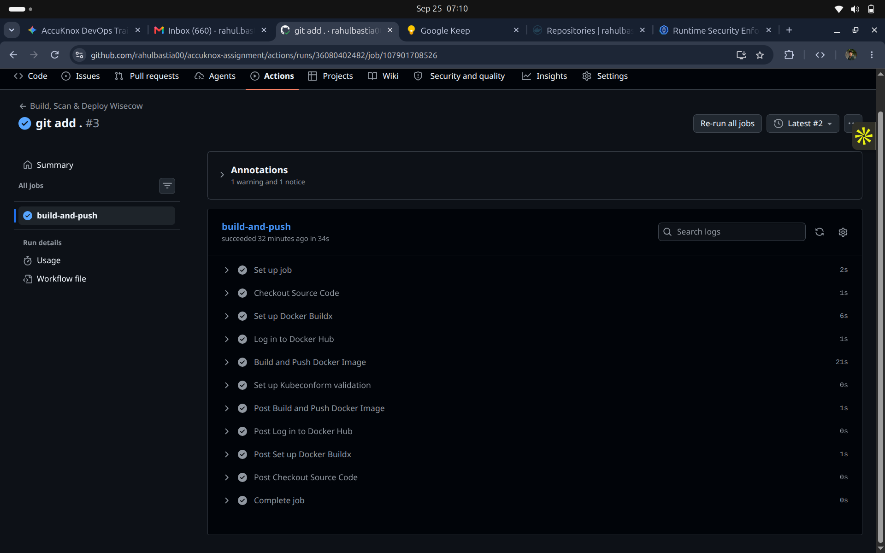
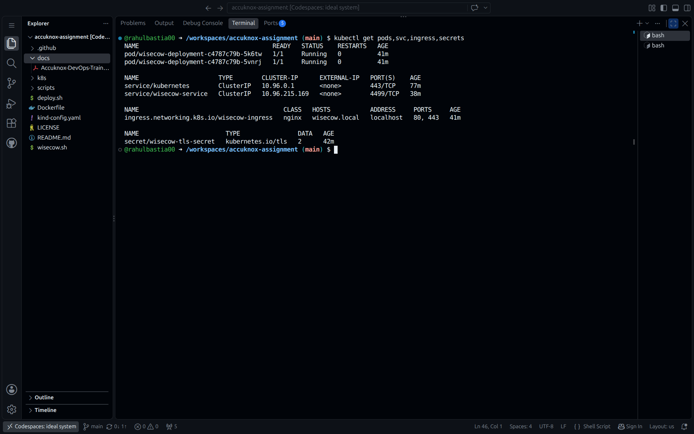
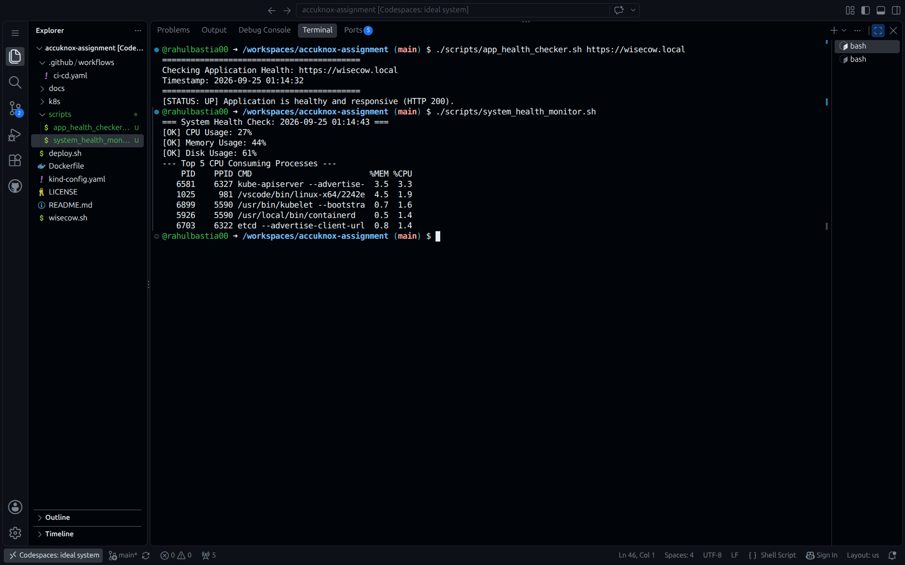
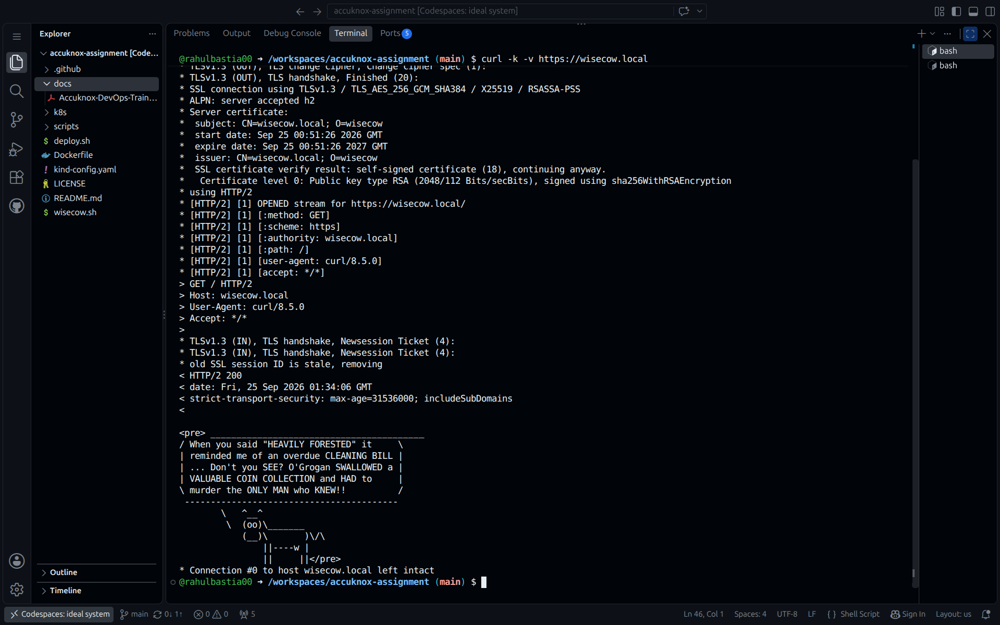

# Wisecow Secure Containerization, Kubernetes Deployment & Zero-Trust Hardening

This repository contains the end-to-end implementation for the **AccuKnox DevOps Trainee Assessment**. It demonstrates production-grade containerization, Kubernetes orchestration, TLS-secured ingress routing, automated CI/CD pipelines, SRE operational scripting, and zero-trust workload security policy authoring.

---

## Architecture Overview


```
                      ┌────────────────────────────┐
                      │   Git Push (main branch)   │
                      └─────────────┬──────────────┘
                                    │
                                    ▼
                      ┌────────────────────────────┐
                      │ GitHub Actions CI Pipeline │
                      │ ─ Kubeconform Validation   │
                      │ ─ Multi-arch Docker Build  │
                      │ ─ Push to Docker Hub       │
                      └─────────────┬──────────────┘
                                    │
                                    ▼
                 ┌──────────────────────────────────────┐
                 │          Kubernetes Cluster          │
                 │                                      │
                 │  [ Ingress-NGINX Controller ]        │
                 │        │ (TLS Termination: 443)      │
                 │        ▼                             │
                 │  [ ClusterIP Service: 4499 ]         │
                 │        │                             │
                 │        ▼                             │
                 │  [ Wisecow Pod (Non-root: 10001) ]   │
                 │        │                             │
                 │        ▼                             │
                 │  [ KubeArmor Zero-Trust Policy ]     │
                 │    - Restrict /etc/shadow, passwd    │
                 │    - Block wget, curl exec           │
                 └──────────────────────────────────────┘

```


---

## Project Structure

```text
├── .github/
│   └── workflows/
│       └── ci-cd.yml                   # GitHub Actions pipeline definition
├── Dockerfile                          # Hardened, unprivileged container image spec
├── wisecow.sh                          # Application entrypoint script
├── k8s/
│   ├── deployment.yaml                 # Deployment with probes, limits & securityContext
│   ├── service.yaml                    # ClusterIP service exposing port 4499
│   ├── ingress.yaml                    # Ingress manifest with TLS termination
│   └── security/
│       └── kubearmor-policy.yaml       # KubeArmor zero-trust process & file security policy
├── scripts/
│   ├── app_health_checker.sh           # PS2: Application uptime & HTTP verification script
│   └── system_health_monitor.sh        # PS2: Linux CPU, memory, disk & process monitoring
├── docs/                               # Verification screenshots
└── README.md
```

---

## Problem Statement 1: Containerization & Kubernetes Deployment

### 1. Hardened Dockerization

* **Base Image:** Minimal Ubuntu LTS runtime.
* **Least-Privilege Execution:** Created dedicated non-root user and group (`appuser:appgroup`, UID `10001`).
* **Deterministic Dependencies:** Bundled `fortune-mod`, `cowsay`, and `netcat-openbsd` with explicit PATH handling.

### 2. Kubernetes Deployment Manifests

* **High Availability & Health Checks:** Configured replica set of 2, pairing TCP socket `livenessProbe` and `readinessProbe` on port 4499.
* **Pod Security Standards:** Configured `securityContext` with `runAsNonRoot: true`, `allowPrivilegeEscalation: false`, and dropped all default Linux capabilities (`drop: ["ALL"]`).
* **Resource Constraints:** Enforced explicit CPU (`100m`/`250m`) and memory (`64Mi`/`128Mi`) requests and limits.

### 3. Secure TLS Ingress Implementation

* Configured Ingress-NGINX with TLS termination using native Kubernetes Secret (`wisecow-tls-secret`).
* Enforced automated SSL redirection via ingress annotations.

### 4. Continuous Integration & Deployment (GitHub Actions)

* Automates container image build, dual tagging (`latest` and `${{ github.sha }}`), and registry push to Docker Hub upon code commits.
* Performs Kubernetes manifest schema and syntax validation in-pipeline using `kubeconform`.

---

## Problem Statement 2: Automation & SRE Scripting

### Objective 1: Application Health Checker (`scripts/app_health_checker.sh`)

Assesses endpoint responsiveness and validates HTTP status codes:

```bash
./scripts/app_health_checker.sh [https://wisecow.local](https://wisecow.local)

```

* Returns `[STATUS: UP]` on HTTP 200.
* Flags unreachable endpoints or connection timeouts with non-zero exit codes for monitoring integration.

### Objective 2: System Health Monitor (`scripts/system_health_monitor.sh`)

Monitors Linux host resource consumption against predefined operational thresholds (80%):

```bash
./scripts/system_health_monitor.sh

```

* Evaluates CPU idle differential, free/used memory percentages, and primary partition disk utilization.
* Surfaces the top 5 CPU-consuming processes when investigating spikes.

---

## Problem Statement 3: KubeArmor Zero-Trust Workload Hardening

To align with AccuKnox's core CNAPP runtime security principles, a native `KubeArmorPolicy` was authored under `k8s/security/kubearmor-policy.yaml`:

* **File System Hardening:** Explicitly blocks read attempts to identity and authentication stores (`/etc/shadow`, `/etc/passwd`).
* **Process Execution Lockdown:** Blocks unauthorized reconnaissance and exfiltration binaries (`/usr/bin/wget`, `/usr/bin/curl`) from executing within the container.

---

## Verification & Proof of Work

### 1. Automated CI/CD Pipeline (GitHub Actions)


### 2. Kubernetes Workload & TLS Ingress Status


### 3. SRE Automation: Application Health Checker & System Health Monitor


### 4. Result


---

## Local Setup & Deployment Guide

```bash
# 1. Clone the repository
git clone [https://github.com/](https://github.com/)<YOUR_USERNAME>/<YOUR_REPO>.git
cd <YOUR_REPO>

# 2. Build and import local image
docker build -t wisecow:latest .

# 3. Create TLS Secret
openssl req -x509 -nodes -days 365 -newkey rsa:2048 \
  -keyout /tmp/tls.key -out /tmp/tls.crt -subj "/CN=wisecow.local/O=wisecow"
kubectl create secret tls wisecow-tls-secret --cert=/tmp/tls.crt --key=/tmp/tls.key

# 4. Deploy Manifests
kubectl apply -f k8s/deployment.yaml
kubectl apply -f k8s/service.yaml
kubectl apply -f k8s/ingress.yaml

# 5. Test Endpoint
curl -k -v [https://wisecow.local](https://wisecow.local)

```